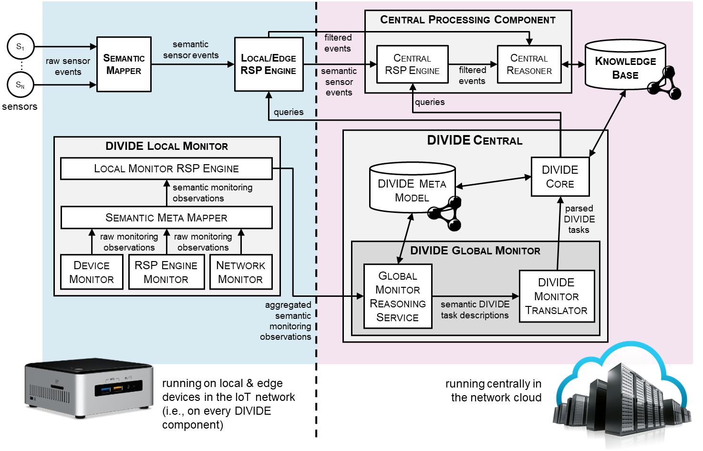

# DIVIDE: adaptive configuration & distribution of semantic stream processing queries across an IoT network, based on dynamically changing environmental context

This repository contains code and data related to DIVIDE. DIVIDE can serve as a component of a semantic IoT platform. The main goal of DIVIDE is to automatically configure and distribute queries for an IoT platform's stream processing components, which filter the IoT data streams. This happens in an adaptive and context-aware and way: DIVIDE automatically adapts the query configuration and distribution according to changing environmental context. Environmental context consists of two main parts: use case (application-specific) context, and situational context in which queries are deployed.

- Whenever the use case context changes, DIVIDE derives the queries that filter the observations of interest for the use case, based on this new or changed context. By performing the reasoning upon context changes, relevant sensors and their observations can be filtered in real-time without the need to perform any more reasoning.
- By continuously monitoring the situational context (networking conditions, stream characteristics, local query performance, device resource usage), the configuration of the query's window parameters (window size and execution frequency) and the distribution of the queries in the network (choosing its evaluation location on either a local or central stream processing engine) can be intelligently updated according to use case specific requirements.

This research is executed at the [IDLab](http://idlab.technology) research group, by researchers from [Ghent University](https://www.ugent.be/en) – [imec](https://www.imec-int.com/en/home).

## Cascading reasoning architecture with DIVIDE

The figure below presents the overall architecture of a typical cascading reasoning set-up in an IoT network, in which DIVIDE should be deployed. More details about this architecture are presented in the papers referenced in this repository. Details about the contents of the repository are given below. 

## Contents

This repository contains a folder related to every publication (paper) about DIVIDE:

- [`saw2019`](saw2019): This folder contains supporting material for the first paper presenting the DIVIDE system. This paper has been presented at the 1st International Workshop on Sensors and Actuators on the Web (SAW2019) at [ISWC 2019](https://iswc2019.semanticweb.org/), and has been published in its proceedings. This paper can be found [here](http://ceur-ws.org/Vol-2549/article-01.pdf).
- [`swj2022`](swj2022): This folder contains supporting material for a first journal paper about DIVIDE. This paper has been published in the Special Issue on Semantic Web Meets Health Data Management of the [Semantic Web Journal](https://www.semantic-web-journal.net/) in 2023. This paper can be found [here](http://dx.doi.org/10.3233/SW-223281).
- [`jnsm2023`](jnsm2023): This folder contains supporting material for a second journal paper about DIVIDE. This paper has been submitted to the [Journal of Network and Systems Management](https://www.springer.com/journal/10922) in 2023 and is currently under review.

Referring back to the architecture figure, the first two papers (`saw2019` and `swj2022` folders) discuss the DIVIDE Core component. The third publication (`jnsm2023` folder) discusses the updated design of DIVIDE, which extends DIVIDE Core with the other subcomponents of DIVIDE Central and also includes the DIVIDE Local Monitor.

In addition, this repository contains details about a first implementation of DIVIDE:

- The implementation of DIVIDE Central is available in the [`src/divide-central`](src/divide-central) folder.
- The implementation of the DIVIDE Local Monitor is available in the [`src/divide-local-monitor`](src/divide-local-monitor) folder.
- The DIVIDE Meta Model ontology is available in the [`meta-model`](meta-model) folder.

## Citation

When referring to DIVIDE, we currently ask you to include a citation to the publication about DIVIDE in the Semantic Web Journal. Details on how to cite are given in the [`swj2022`](swj2022) folder.

## Contact
 
The main contact person directly involved with this research is [Mathias De Brouwer](https://www.linkedin.com/in/mathiasdebrouwer/). In case of any remarks or questions, you can email [mrdbrouw.DeBrouwer@UGent.be](mailto:mrdbrouw.DeBrouwer@UGent.be) or [create a GitHub issue](../../issues/new).
