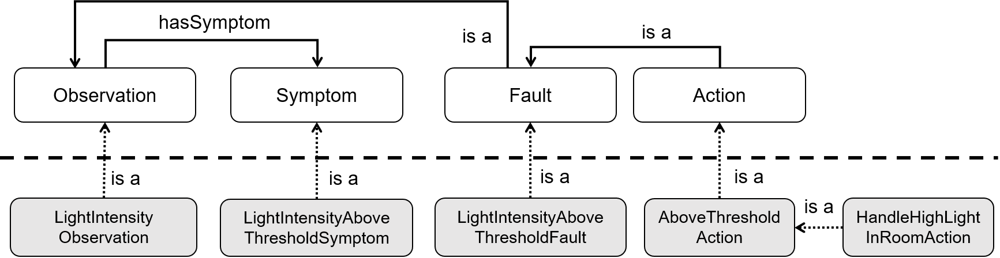

# Ontology observation pattern

*\[This folder contains some additional visual and textual explanation of the ontology observation pattern explained & used in the running example of the paper "DIVIDE: Adaptive Context-Aware Query Derivation for IoT Data Streams".\]*

As explained in the paper, the ontology used for the running example is the ACCIO continuous care ontology.

To understand how the running example works, this page explains the ontology pattern that is introduced in the paper, in much more detail [1]. This was unfortunately not possible in the paper, due to space restrictions.

The figure below details how `Observation`, `Symptom`, `Fault`, and `Action` are related. Please note the following things here:
- A `Symptom` is always attached to an `Observation`, and hence is a different individual.
- Each `Action` individual is also a `Fault`, and each `Fault` individual is also an `Observation`.
  - These classes are defined as subclasses of each other, to make it possible with OWL 2 RL reasoning to derive whether an `Observation` individual is also a `Fault`, and whether a `Fault` individual is also some `Action`.
  - The ontology itself contains examples of `Fault` and `Action` types. The class definitions in the ontology define when an `Observation` becomes a `Fault`, and when a `Fault` becomes an `Action`. Additional conditions need to be fulfilled for that, so it is not true that each `Observation` by default is a `Fault`, and each `Fault` by default is an `Action`. Please check the ontology files for all the concrete definitions (some of them are also included in the paper).
- Please note the difference between a `Symptom` in the figure below (e.g. a `ThresholdSymptom`), and a `MedicalSymptom`. The `Symptom` class is meant for individuals associated to an `Observation` that indicate something that might possibly be wrong (i.e., a potential `Fault`). A `MedicalSymptom` is not at all related to this observation pattern and is associated to a certain type of `Diagnosis` to indicate the sensititivies of such a diagnosis (according to the modeled medical domain knowledge).

**A note about the generic query:** Note that no individual that is of type `Observation`, `Fault` or `Action`, by default also is an individual of the other 2 types. Therefore, in the running example, the CONSTRUCT part of the generic query pattern (part of the sensor query rule) constructs individuals of the same type as the type defined in the reasoner goal (in this case: `AboveThresholdAction`). This makes perfectly sense regarding how DIVIDE is built: the goal defines the individuals you want to filter in real-time without requiring reasoning, so these will be constructed (i.e. filtered) by the instantiated queries. Moreover, also note that in the generic query, the `AboveThresholdAction` is not linked to the room or location. This is not required, as each instantiated query will run locally on an RSP engine in the corresponding room. Hence, the local component will take care of handling the action, e.g. talking to the local actuators that can "process" the action (e.g. turning of all lights in the room for a `HandleHighLightInRoomAction`).

We acknowledge that the example in the paper is rather complicated, and might have been a little hard to follow without having some additional explanation like added on this page. However, domain knowledge in IoT domains like healthcare is simply very complex. In order to have a realistic example, we therefore had to incorporate this complex domain knowledge from an existing continuous care ontology. DIVIDE is especially useful if the required real-time reasoning is expressive (~ complex), as DIVIDE can replace the real-time reasoning with basic filtering. Summarizing, a complex example like this is realistic ánd necessary to demonstrate the benefits of DIVIDE.

[1] Verstichel, S., et al.: Distributed ontology-based monitoring on the IBBT WiLab.t infrastructure. In: TRIDENTCOM 2010. pp. 509–525. Springer (2010).

## Contact
 
The main contact person directly involved with this research is [Mathias De Brouwer](https://www.linkedin.com/in/mathiasdebrouwer/). In case of any remarks or questions, you can send an email to [mrdbrouw.DeBrouwer@UGent.be](mailto:mrdbrouw.DeBrouwer@UGent.be) or [create a GitHub issue](../../../../issues/new).
